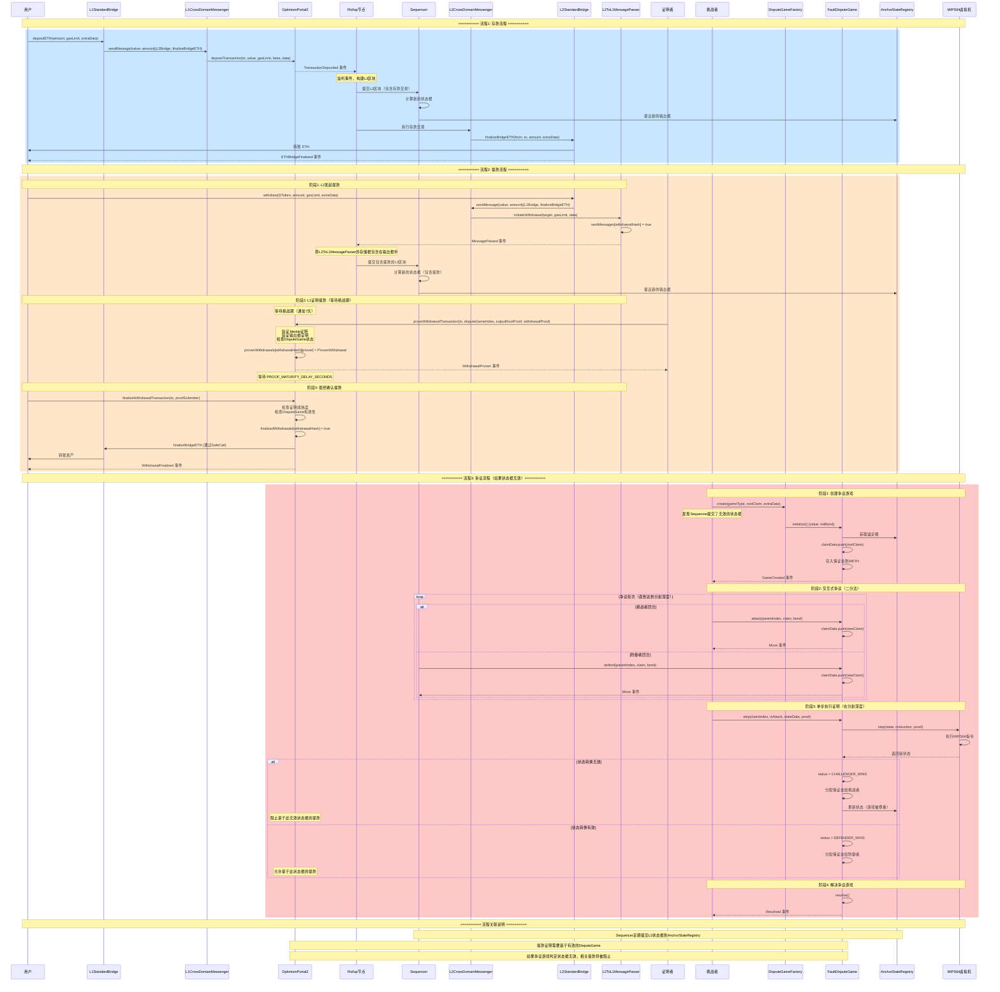
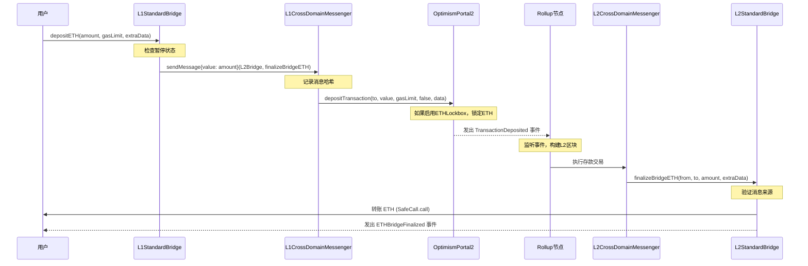
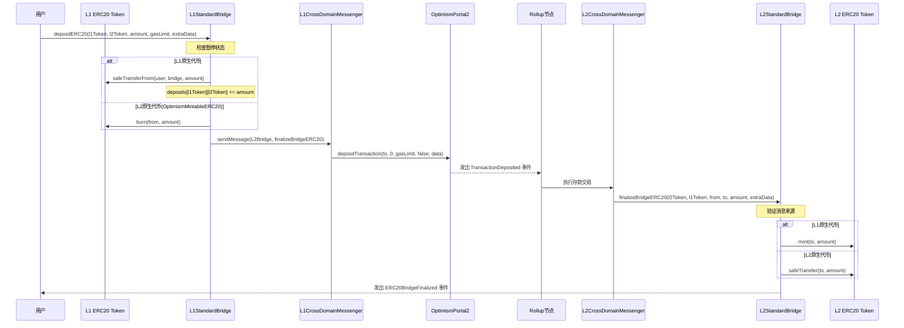
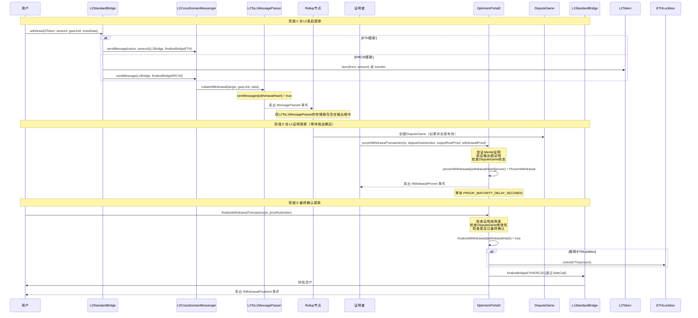
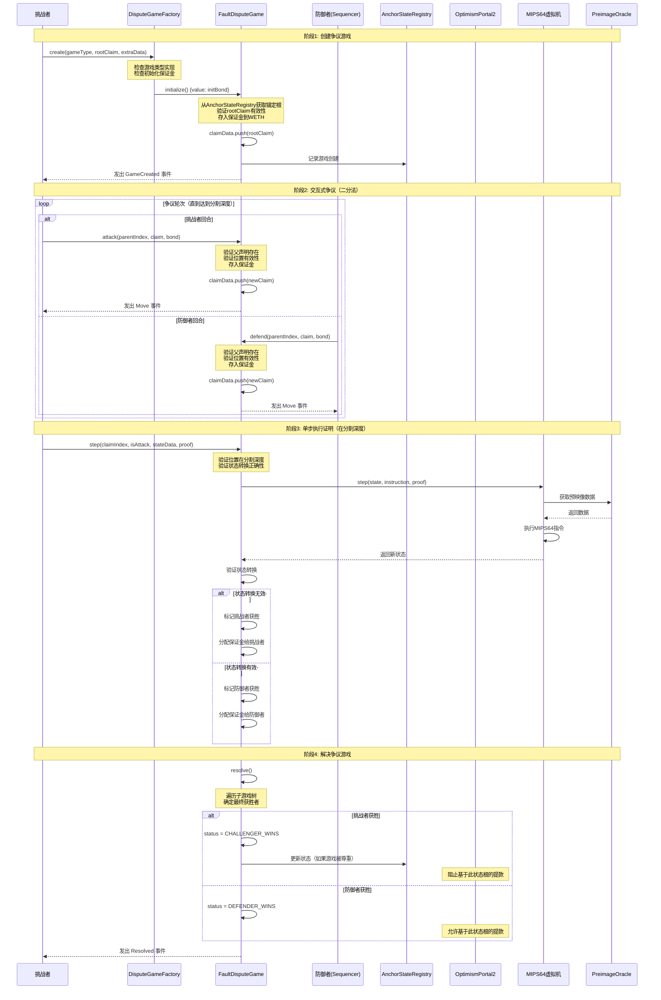
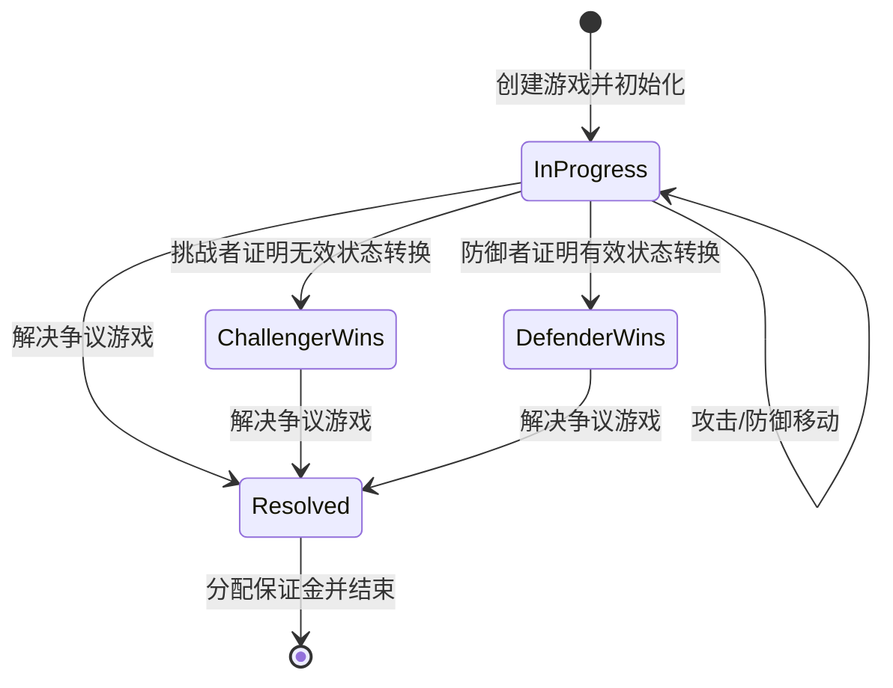
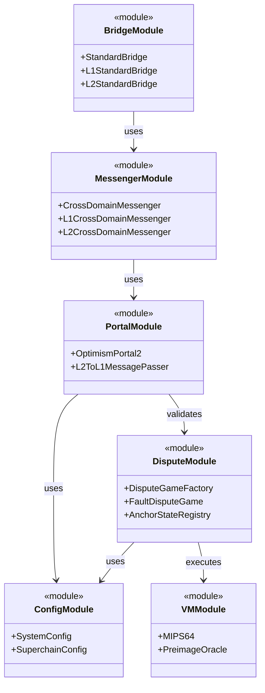
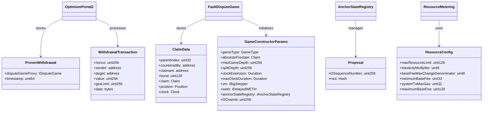

# Optimism Bedrock 主要流程时序图

## 综合时序图（存款、提款、争议）

## 1. 存款流程（Deposit）

### ETH 存款流程

### ERC20 存款流程

## 2. 提款流程（Withdrawal）

### 提款完整流程（包含证明和最终确认）

## 3. 争议流程（Dispute）

### 争议游戏完整流程

### 争议游戏状态转换

## 关键合约交互说明

### 存款流程关键点

1. **L1 → L2**: 通过 `OptimismPortal2.depositTransaction` 发出事件，Rollup节点监听并构建L2交易
2. **消息传递**: 使用 `CrossDomainMessenger` 确保消息的可信传递
3. **代币处理**:
   - L1原生代币：在L1锁定，在L2铸造
   - L2原生代币：在L1销毁，在L2转移

### 提款流程关键点

1. **三阶段流程**:
   - 阶段1: L2发起提款，记录在 `L2ToL1MessagePasser`
   - 阶段2: 在L1证明提款（需要Merkle证明和有效的DisputeGame）
   - 阶段3: 等待成熟期后最终确认
2. **证明要求**: 需要提供输出根证明和Merkle包含证明
3. **安全机制**: `PROOF_MATURITY_DELAY_SECONDS` 防止重放攻击

### 争议流程关键点

1. **交互式二分法**: 通过不断缩小争议范围，最终在单步执行上验证
2. **保证金机制**: 双方都需要存入保证金，失败方损失保证金
3. **MIPS64执行**: 在分割深度使用MIPS64虚拟机执行单步证明
4. **状态根验证**: 通过 `AnchorStateRegistry` 管理有效的状态根

## 核心流程类图

### 完整类图

```mermaid
classDiagram
    %% 基础类和接口
    class Initializable {
        <<OpenZeppelin>>
        +initialized
        +initializer()
        +onlyInitializing
    }
    
    class ISemver {
        <<interface>>
        +version() string
    }
    
    class ProxyAdminOwnedBase {
        <<abstract>>
        +_assertOnlyProxyAdminOrProxyAdminOwner()
    }
    
    class ReinitializableBase {
        <<abstract>>
        +initVersion() uint256
        +reinitializer()
    }
    
    class ResourceMetering {
        <<abstract>>
        +_resourceConfig() ResourceConfig
        +metered()
    }

    %% 桥接系统
    class StandardBridge {
        <<abstract>>
        #messenger: ICrossDomainMessenger
        #otherBridge: StandardBridge
        #deposits: mapping
        +bridgeETH()
        +bridgeERC20()
        +finalizeBridgeETH()
        +finalizeBridgeERC20()
        #_initiateBridgeETH()
        #_initiateBridgeERC20()
    }
    
    class L1StandardBridge {
        +systemConfig: ISystemConfig
        +depositETH()
        +depositERC20()
        +finalizeETHWithdrawal()
        +finalizeERC20Withdrawal()
    }
    
    class L2StandardBridge {
        +withdraw()
        +withdrawTo()
        +finalizeBridgeETH()
        +finalizeBridgeERC20()
    }

    %% 消息传递系统
    class CrossDomainMessenger {
        <<abstract>>
        #xDomainMsgSender: address
        #msgNonce: uint240
        #successfulMessages: mapping
        #failedMessages: mapping
        +sendMessage()
        +relayMessage()
        +xDomainMessageSender() address
    }
    
    class L1CrossDomainMessenger {
        +portal: IOptimismPortal
        +systemConfig: ISystemConfig
        +sendMessage()
        +relayMessage()
    }
    
    class L2CrossDomainMessenger {
        +sendMessage()
        +relayMessage()
    }
    
    class ICrossDomainMessenger {
        <<interface>>
        +sendMessage()
        +relayMessage()
        +xDomainMessageSender()
    }

    %% Portal系统
    class OptimismPortal2 {
        +systemConfig: ISystemConfig
        +anchorStateRegistry: IAnchorStateRegistry
        +l2Sender: address
        +finalizedWithdrawals: mapping
        +provenWithdrawals: mapping
        +depositTransaction()
        +proveWithdrawalTransaction()
        +finalizeWithdrawalTransaction()
        +checkWithdrawal()
    }
    
    class L2ToL1MessagePasser {
        +sentMessages: mapping
        +msgNonce: uint240
        +initiateWithdrawal()
        +burn()
    }

    %% 争议系统
    class IDisputeGame {
        <<interface>>
        +gameType() GameType
        +rootClaim() Claim
        +status() GameStatus
        +createdAt() Timestamp
        +resolve()
    }
    
    class DisputeGameFactory {
        +gameImpls: mapping
        +initBonds: mapping
        +gameArgs: mapping
        +create()
        +setImplementation()
        +setInitBond()
    }
    
    class FaultDisputeGame {
        +GAME_TYPE: GameType
        +MAX_GAME_DEPTH: uint256
        +SPLIT_DEPTH: uint256
        +VM: IBigStepper
        +WETH: IDelayedWETH
        +claimData: ClaimData[]
        +initialize()
        +attack()
        +defend()
        +step()
        +resolve()
    }
    
    class AnchorStateRegistry {
        +systemConfig: ISystemConfig
        +disputeGameFactory: IDisputeGameFactory
        +anchorGame: IFaultDisputeGame
        +respectedGameType: GameType
        +disputeGameBlacklist: mapping
        +getAnchorRoot()
        +setAnchorState()
        +isGameProper()
        +isGameRespected()
        +isGameClaimValid()
    }

    %% 配置系统
    class SystemConfig {
        +superchainConfig: ISuperchainConfig
        +batcherHash: bytes32
        +gasLimit: uint64
        +resourceConfig: ResourceConfig
        +paused() bool
        +updateBatcherHash()
        +updateGasConfig()
    }
    
    class SuperchainConfig {
        +paused: bool
        +guardian: address
        +setPaused()
        +setGuardian()
    }

    %% 虚拟机系统
    class MIPS64 {
        +ORACLE: IPreimageOracle
        +STATE_VERSION: uint256
        +step()
        +executeInstruction()
    }
    
    class PreimageOracle {
        +localData: mapping
        +globalData: mapping
        +loadLocalData()
        +loadGlobalData()
    }
    
    class IBigStepper {
        <<interface>>
        +step()
        +oracle() IPreimageOracle
    }

    %% 继承关系
    StandardBridge --|> Initializable
    L1StandardBridge --|> StandardBridge
    L1StandardBridge --|> ProxyAdminOwnedBase
    L1StandardBridge --|> ReinitializableBase
    L1StandardBridge --|> ISemver
    L2StandardBridge --|> StandardBridge
    L2StandardBridge --|> ISemver
    
    CrossDomainMessenger --|> Initializable
    L1CrossDomainMessenger --|> CrossDomainMessenger
    L1CrossDomainMessenger --|> ProxyAdminOwnedBase
    L1CrossDomainMessenger --|> ReinitializableBase
    L1CrossDomainMessenger --|> ISemver
    L2CrossDomainMessenger --|> CrossDomainMessenger
    L2CrossDomainMessenger --|> ISemver
    
    OptimismPortal2 --|> Initializable
    OptimismPortal2 --|> ResourceMetering
    OptimismPortal2 --|> ReinitializableBase
    OptimismPortal2 --|> ProxyAdminOwnedBase
    OptimismPortal2 --|> ISemver
    
    L2ToL1MessagePasser --|> ISemver
    
    FaultDisputeGame ..|> IDisputeGame
    FaultDisputeGame --|> Clone
    FaultDisputeGame --|> ISemver
    
    DisputeGameFactory --|> ProxyAdminOwnedBase
    DisputeGameFactory --|> ReinitializableBase
    DisputeGameFactory --|> OwnableUpgradeable
    DisputeGameFactory --|> ISemver
    
    AnchorStateRegistry --|> ProxyAdminOwnedBase
    AnchorStateRegistry --|> Initializable
    AnchorStateRegistry --|> ReinitializableBase
    AnchorStateRegistry --|> ISemver
    
    SystemConfig --|> ProxyAdminOwnedBase
    SystemConfig --|> OwnableUpgradeable
    SystemConfig --|> ReinitializableBase
    SystemConfig --|> ISemver
    
    SuperchainConfig --|> ProxyAdminOwnedBase
    SuperchainConfig --|> Initializable
    SuperchainConfig --|> ReinitializableBase
    SuperchainConfig --|> ISemver

    %% 依赖关系
    StandardBridge --> ICrossDomainMessenger : uses
    L1StandardBridge --> SystemConfig : uses
    L1CrossDomainMessenger --> OptimismPortal2 : uses
    L1CrossDomainMessenger --> SystemConfig : uses
    OptimismPortal2 --> SystemConfig : uses
    OptimismPortal2 --> AnchorStateRegistry : uses
    OptimismPortal2 --> IDisputeGame : checks
    AnchorStateRegistry --> SystemConfig : uses
    AnchorStateRegistry --> DisputeGameFactory : uses
    AnchorStateRegistry --> IFaultDisputeGame : manages
    DisputeGameFactory --> IDisputeGame : creates
    FaultDisputeGame --> IBigStepper : uses
    FaultDisputeGame --> IDelayedWETH : uses
    FaultDisputeGame --> AnchorStateRegistry : updates
    MIPS64 --> PreimageOracle : uses
    FaultDisputeGame --> MIPS64 : executes
```

### 核心模块关系图

### 关键数据结构

## 相关合约地址

- **L1StandardBridge**: L1标准桥接合约
- **L2StandardBridge**: L2标准桥接合约（预部署地址: `0x4200000000000000000000000000000000000010`）
- **OptimismPortal2**: L1入口合约，处理存款和提款
- **L2ToL1MessagePasser**: L2消息传递者（预部署地址: `0x4200000000000000000000000000000000000016`）
- **DisputeGameFactory**: 争议游戏工厂
- **FaultDisputeGame**: 故障争议游戏实现
- **AnchorStateRegistry**: 锚定状态注册表
