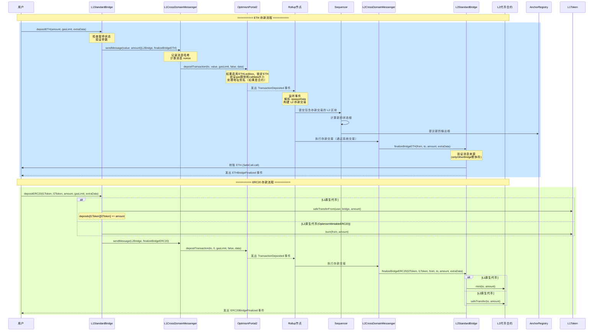
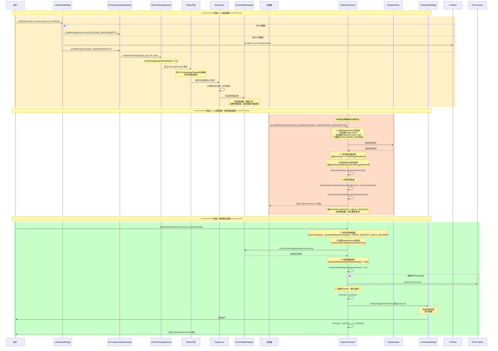
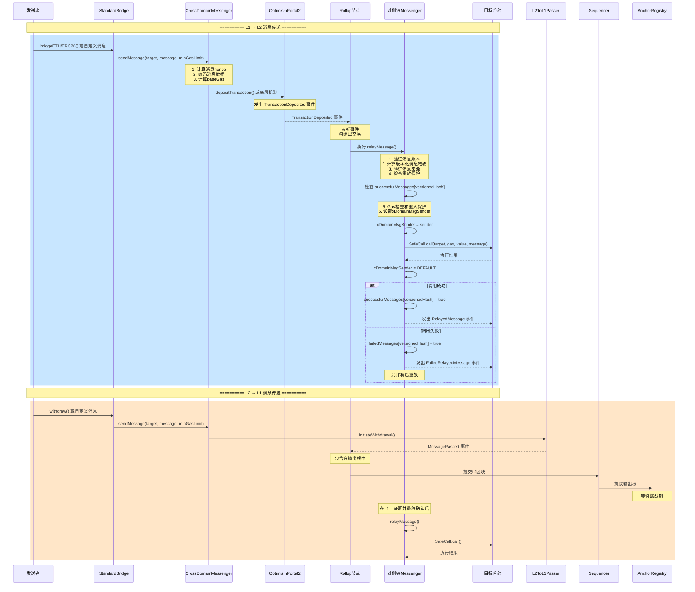
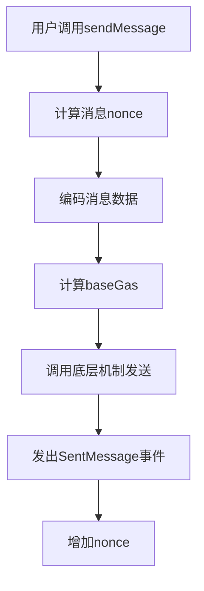
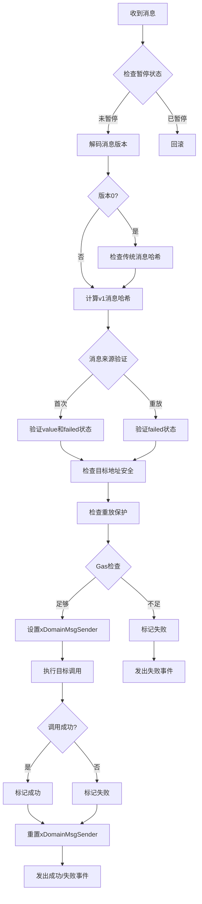
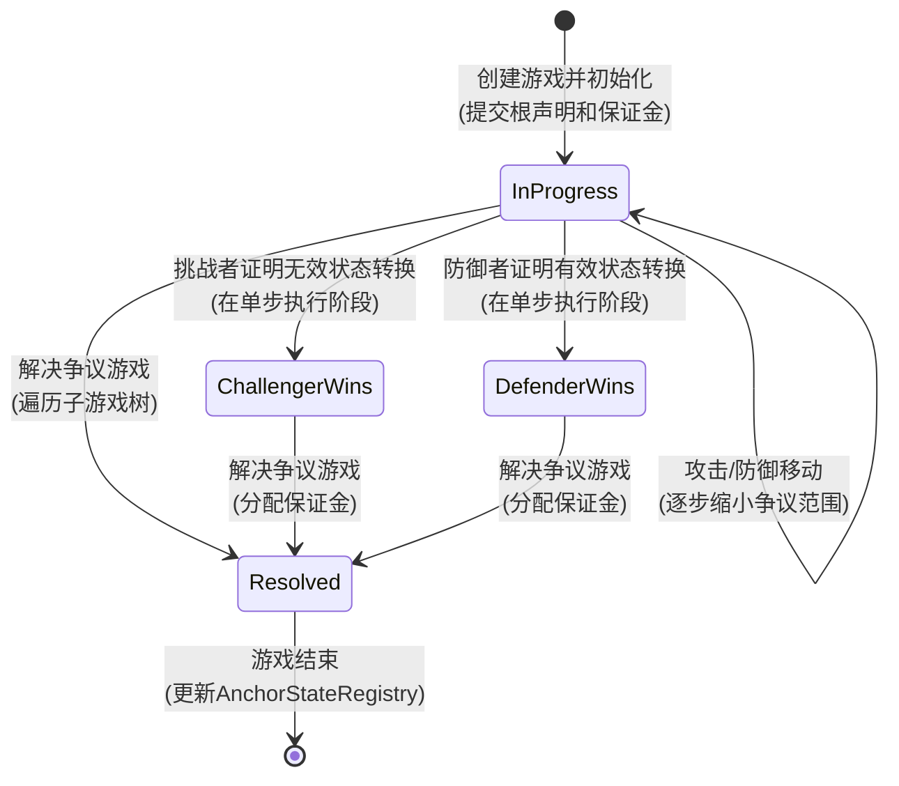
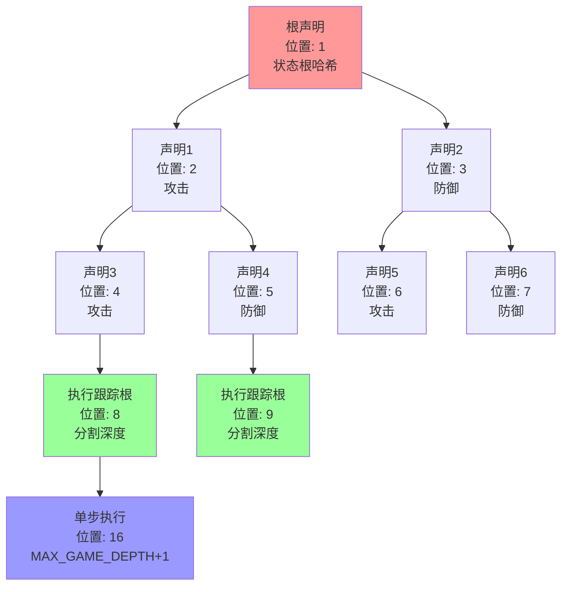
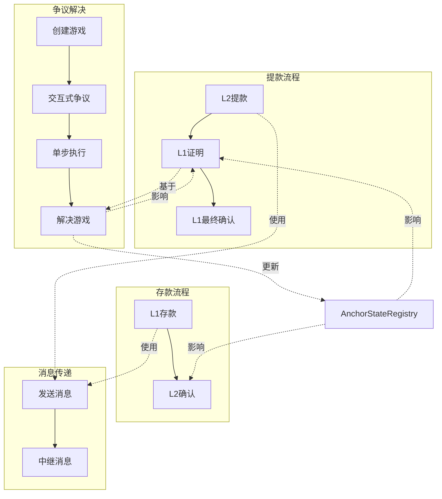

# Optimism Bedrock 核心流程工作原理

## 目录
1. [存款流程](#1-存款流程)
2. [提款流程](#2-提款流程)
3. [消息传递流程](#3-消息传递流程)
4. [争议解决流程](#4-争议解决流程)

---

## 1. 存款流程

### 1.1 工作原理总结

存款流程允许用户将资产从 L1 转移到 L2。核心机制是通过事件驱动的异步处理。

**关键特点：**
- **事件驱动**：L1 发出 `TransactionDeposited` 事件，Rollup 节点监听并构建 L2 交易
- **地址别名**：L1 合约地址在 L2 上会被别名化（+ 0x1111...1111），防止地址冲突
- **代币处理**：
  - **L1 原生代币**：在 L1 锁定，在 L2 铸造
  - **L2 原生代币（OptimismMintableERC20）**：在 L1 销毁，在 L2 转移
- **ETH 处理**：Bedrock 后，ETH 存储在 OptimismPortal 中（之前存储在 L1StandardBridge）

**安全机制：**
- Gas 限制检查：防止用户不支付资源使用费用
- Calldata 大小限制：120kb，防止过大的交易
- 地址别名：防止 L1 合约地址与 L2 地址冲突

### 1.2 存款流程时序图



### 1.3 关键代码路径

**ETH 存款：**
```
用户 → L1StandardBridge.depositETH()
     → L1CrossDomainMessenger.sendMessage()
     → OptimismPortal2.depositTransaction()
     → 发出 TransactionDeposited 事件
     → Rollup 节点监听事件
     → L2 上执行 L2StandardBridge.finalizeBridgeETH()
```

**ERC20 存款：**
```
用户 → L1StandardBridge.depositERC20()
     → 锁定/销毁代币
     → L1CrossDomainMessenger.sendMessage()
     → OptimismPortal2.depositTransaction()
     → Rollup 节点监听事件
     → L2 上执行 L2StandardBridge.finalizeBridgeERC20()
     → 铸造/转移代币
```

---

## 2. 提款流程

### 2.1 工作原理总结

提款流程允许用户将资产从 L2 转移到 L1。这是一个三阶段流程，需要证明和最终确认。

**三阶段流程：**

1. **阶段1：L2 发起提款**
   - 用户在 L2 调用 `L2StandardBridge.withdraw()`
   - 通过 `L2CrossDomainMessenger` 发送消息到 L1
   - 消息记录在 `L2ToL1MessagePasser` 合约中
   - Rollup 节点将 `L2ToL1MessagePasser` 的存储根包含在输出根中

2. **阶段2：L1 证明提款**
   - 等待挑战期（通常 7 天）确保状态根有效
   - 证明者调用 `OptimismPortal2.proveWithdrawalTransaction()`
   - 提供 Merkle 包含证明和输出根证明
   - 验证基于有效的 DisputeGame
   - 记录证明信息，等待成熟期

3. **阶段3：最终确认提款**
   - 等待证明成熟期（`PROOF_MATURITY_DELAY_SECONDS`）
   - 用户调用 `OptimismPortal2.finalizeWithdrawalTransaction()`
   - 验证证明成熟度和 DisputeGame 有效性
   - 执行提款交易，释放资产

**安全机制：**
- **Merkle 证明**：证明提款确实在 L2 上发生
- **输出根证明**：证明状态根的有效性
- **DisputeGame 验证**：确保基于有效的争议游戏
- **成熟期延迟**：防止重放攻击，给挑战者时间质疑
- **重入保护**：使用 `l2Sender` 防止重入

### 2.2 提款流程时序图



### 2.3 关键代码路径

**提款完整流程：**
```
阶段1: L2
用户 → L2StandardBridge.withdraw()
     → L2CrossDomainMessenger.sendMessage()
     → L2ToL1MessagePasser.initiateWithdrawal()
     → 记录 sentMessages[withdrawalHash] = true
     → Rollup节点包含在输出根中

阶段2: L1证明
证明者 → OptimismPortal2.proveWithdrawalTransaction()
       → 验证DisputeGame有效性
       → 验证输出根证明
       → 验证Merkle包含证明
       → 记录 provenWithdrawals[withdrawalHash][prover]
       → 等待成熟期

阶段3: L1最终确认
用户 → OptimismPortal2.finalizeWithdrawalTransaction()
     → checkWithdrawal() 验证所有条件
     → 标记 finalizedWithdrawals[withdrawalHash] = true
     → 执行提款交易
     → L1StandardBridge.finalizeBridgeETH/ERC20()
```

---

## 3. 消息传递流程

### 3.1 工作原理总结

消息传递是 Optimism 跨链通信的基础机制，允许 L1 和 L2 之间的任意数据传递。

**核心机制：**
- **双向通信**：支持 L1 → L2 和 L2 → L1 的消息传递
- **消息哈希**：使用版本化消息哈希（v1）作为唯一标识符
- **重放保护**：使用 `successfulMessages` 映射防止重复执行
- **失败重放**：使用 `failedMessages` 映射允许重放失败的消息
- **Gas 管理**：精确计算和预留 gas，确保目标调用有足够 gas

**消息版本：**
- **版本 0**：传统消息（向后兼容）
- **版本 1**：当前版本，包含 value 和 minGasLimit 的承诺

**安全机制：**
- **消息来源验证**：`onlyOtherBridge` 确保只有对侧链的桥接合约可以触发
- **重入保护**：使用 `xDomainMsgSender` 防止重入
- **Gas 检查**：确保有足够 gas 执行目标调用
- **失败处理**：失败的消息可以重放，不会永久锁定

### 3.2 消息传递流程时序图



### 3.3 消息传递详细流程

**发送消息（sendMessage）：**


**中继消息（relayMessage）：**


### 3.4 关键代码路径

**发送消息：**
```
用户 → CrossDomainMessenger.sendMessage()
     → 计算消息nonce和baseGas
     → 编码消息数据
     → 调用底层机制（Portal或L2ToL1Passer）
     → 发出SentMessage事件
```

**中继消息：**
```
对侧链 → CrossDomainMessenger.relayMessage()
       → 验证消息版本和哈希
       → 验证消息来源和重放状态
       → Gas检查和重入保护
       → 执行目标调用
       → 更新成功/失败状态
```

---

## 4. 争议解决流程

### 4.1 工作原理总结

争议解决是 Optimism 的安全核心，通过交互式争议游戏来验证 L2 状态根的有效性。

**核心机制：**

1. **交互式二分法（Interactive Bisection）**
   - 挑战者和防御者通过攻击（attack）和防御（defend）移动逐步缩小争议范围
   - **输出根二分法**：从根声明开始，逐步缩小到分割深度（split depth）
   - **执行跟踪二分法**：在分割深度以下，继续二分法直到单步执行深度

2. **单步执行证明（Single-Step Execution Proof）**
   - 在分割深度以下，使用 MIPS64 虚拟机执行单条指令
   - 验证状态转换的正确性
   - 如果状态转换无效，挑战者获胜；否则防御者获胜

3. **游戏解决（Game Resolution）**
   - 自底向上遍历子游戏树
   - 确定每个子游戏的获胜者
   - 最终确定全局游戏的获胜者
   - 分配保证金

**关键概念：**
- **根声明（Root Claim）**：挑战的状态根哈希
- **位置（Position）**：声明在游戏树中的位置（gindex）
- **分割深度（Split Depth）**：输出根二分法和执行跟踪二分法的分界点
- **时钟（Clock）**：超时机制，防止一方通过拖延获胜
- **保证金（Bond）**：双方都需要存入，失败方损失保证金

**安全机制：**
- **时钟机制**：每个移动都有时间限制
- **时钟扩展**：在关键位置自动扩展时钟
- **保证金机制**：激励正确行为
- **位置验证**：确保移动在正确的位置
- **单步验证**：使用 MIPS64 虚拟机进行最终验证

### 4.2 争议解决流程时序图

```mermaid
sequenceDiagram
    participant Challenger as 挑战者
    participant Factory as DisputeGameFactory
    participant Game as FaultDisputeGame
    participant Defender as 防御者(Sequencer)
    participant AnchorRegistry as AnchorStateRegistry
    participant MIPS64 as MIPS64虚拟机
    participant PreimageOracle as PreimageOracle
    participant Portal as OptimismPortal2

    Note over Challenger,Portal: ========== 阶段1: 创建争议游戏 ==========
    rect rgb(255, 200, 200)
        Challenger->>Factory: create(gameType, rootClaim, extraData)
        Note over Challenger: 发现Sequencer提交了无效的状态根
        Factory->>Factory: 检查游戏类型实现<br/>检查初始化保证金
        Factory->>Game: initialize() {value: initBond}
        Note over Game: 1. 从AnchorStateRegistry获取锚定根<br/>2. 验证rootClaim有效性<br/>3. 验证calldata长度
        Game->>AnchorRegistry: getAnchorRoot()
        AnchorRegistry-->>Game: 返回锚定根和区块号
        Game->>Game: 验证l2BlockNumber() > rootBlockNumber
        Game->>Game: claimData.push(rootClaim)
        Game->>Game: 存入保证金到WETH
        Game->>Game: 设置createdAt和wasRespectedGameTypeWhenCreated
        Game-->>Challenger: 发出 GameCreated 事件
    end

    Note over Challenger,Portal: ========== 阶段2: 交互式争议（输出根二分法）==========
    rect rgb(255, 220, 200)
        loop 争议轮次（直到达到分割深度）
            alt 挑战者回合
                Challenger->>Game: attack(parentIndex, claim, bond)
                Note over Game: 1. 验证父声明存在<br/>2. 验证位置有效性<br/>3. 验证不能防御根声明<br/>4. 验证保证金数量
                Game->>Game: 计算下一个位置（向左移动）
                Game->>Game: 计算时钟（超时机制）
                Game->>Game: 验证声明哈希唯一性
                Game->>Game: claimData.push(newClaim)
                Game->>Game: 存入保证金
                Game->>Game: 更新子游戏结构
                Game-->>Challenger: 发出 Move 事件
            else 防御者回合
                Defender->>Game: defend(parentIndex, claim, bond)
                Note over Game: 1. 验证父声明存在<br/>2. 验证位置有效性<br/>3. 验证不能防御根声明<br/>4. 验证保证金数量
                Game->>Game: 计算下一个位置（向右移动）
                Game->>Game: 计算时钟（超时机制）
                Game->>Game: claimData.push(newClaim)
                Game->>Game: 存入保证金
                Game->>Game: 更新子游戏结构
                Game-->>Defender: 发出 Move 事件
            end
        end
        Note over Game: 达到分割深度（SPLIT_DEPTH）<br/>进入执行跟踪二分法阶段
    end

    Note over Challenger,Portal: ========== 阶段3: 交互式争议（执行跟踪二分法）==========
    rect rgb(255, 240, 200)
        loop 争议轮次（直到达到MAX_GAME_DEPTH）
            alt 挑战者回合
                Challenger->>Game: attack(parentIndex, claim, bond)
                Note over Game: 验证位置在分割深度以下<br/>验证执行跟踪根声明
            else 防御者回合
                Defender->>Game: defend(parentIndex, claim, bond)
            end
        end
        Note over Game: 达到MAX_GAME_DEPTH<br/>进入单步执行阶段
    end

    Note over Challenger,Portal: ========== 阶段4: 单步执行证明 ==========
    rect rgb(200, 255, 200)
        Challenger->>Game: step(claimIndex, isAttack, stateData, proof)
        Note over Game: 1. 验证位置在MAX_GAME_DEPTH + 1<br/>2. 确定前置状态和后置状态<br/>3. 验证stateData是前置状态的预映像
        Game->>Game: 计算本地预映像上下文
        Game->>MIPS64: step(stateData, proof, uuid)
        Note over MIPS64: 执行MIPS64指令
        MIPS64->>PreimageOracle: 获取预映像数据
        PreimageOracle-->>MIPS64: 返回数据
        MIPS64->>MIPS64: 执行指令并计算新状态
        MIPS64-->>Game: 返回新状态哈希
        Game->>Game: 验证执行结果
        alt 状态转换无效
            Note over Game: validStep = false<br/>parentPostAgree = false
            Game->>Game: 标记挑战者获胜
            Game->>Game: parent.counteredBy = challenger
        else 状态转换有效
            Note over Game: validStep = true<br/>parentPostAgree = true
            Game->>Game: 标记防御者获胜
        end
    end

    Note over Challenger,Portal: ========== 阶段5: 解决争议游戏 ==========
    rect rgb(200, 230, 255)
        Note over Game: 自底向上解决子游戏
        loop 解决每个子游戏
            Game->>Game: resolveClaim(claimIndex, numToResolve)
            Note over Game: 1. 检查子游戏是否已解决<br/>2. 遍历子游戏树<br/>3. 确定子游戏获胜者<br/>4. 更新counteredBy字段
        end
        Game->>Game: resolve()
        Note over Game: 检查根子游戏已解决
        Game->>Game: 根据根声明是否被反驳确定全局获胜者
        alt 挑战者获胜
            Game->>Game: status = CHALLENGER_WINS
            Game->>Game: 分配保证金给挑战者
            Game->>AnchorRegistry: 更新状态（如果游戏被尊重）
            Note over Portal: 阻止基于此无效状态根的提款
        else 防御者获胜
            Game->>Game: status = DEFENDER_WINS
            Game->>Game: 分配保证金给防御者
            Note over Portal: 允许基于此状态根的提款
        end
        Game-->>Challenger: 发出 Resolved 事件
    end
```



### 4.3 争议游戏状态转换



### 4.4 争议游戏树结构



### 4.5 关键代码路径

**创建游戏：**
```
挑战者 → DisputeGameFactory.create()
       → FaultDisputeGame.initialize()
       → 从AnchorStateRegistry获取锚定根
       → 验证根声明有效性
       → 创建根声明并存入保证金
```

**交互式争议：**
```
挑战者/防御者 → FaultDisputeGame.attack()/defend()
              → move() 通用移动函数
              → 验证位置和保证金
              → 计算时钟
              → 创建新声明
              → 更新子游戏结构
```

**单步执行：**
```
挑战者 → FaultDisputeGame.step()
       → 验证位置在MAX_GAME_DEPTH + 1
       → 确定前置状态和后置状态
       → MIPS64.step() 执行单条指令
       → 验证执行结果
       → 标记父声明为被反驳（如果无效）
```

**解决游戏：**
```
任何人 → FaultDisputeGame.resolveClaim() (解决子游戏)
      → FaultDisputeGame.resolve() (解决全局游戏)
      → 遍历子游戏树
      → 确定获胜者
      → 分配保证金
      → 更新游戏状态
```

---

## 5. 核心流程关联

### 5.1 流程之间的关联



### 5.2 关键依赖关系

1. **提款依赖争议解决**
   - 提款证明必须基于有效的 DisputeGame
   - 如果争议游戏判定状态根无效，相关提款将被阻止

2. **争议解决影响状态根**
   - 争议游戏的结果更新 AnchorStateRegistry
   - 有效的状态根用于验证新的提款

3. **消息传递是基础**
   - 存款和提款都通过消息传递实现
   - 消息传递提供跨链通信的基础设施

4. **Sequencer 的角色**
   - Sequencer 提交 L2 状态根到 AnchorStateRegistry
   - 如果状态根无效，挑战者可以创建争议游戏
   - 防御者（通常是 Sequencer）需要参与争议游戏

---

## 6. 安全机制总结

### 6.1 存款流程安全机制

- **Gas 限制检查**：防止资源滥用
- **Calldata 大小限制**：防止过大的交易
- **地址别名**：防止地址冲突
- **消息来源验证**：确保只有对侧链可以最终确认

### 6.2 提款流程安全机制

- **三阶段流程**：防止即时提款，给挑战者时间
- **Merkle 证明**：证明提款确实在 L2 发生
- **输出根证明**：验证状态根的有效性
- **DisputeGame 验证**：确保基于有效的争议游戏
- **成熟期延迟**：防止重放攻击
- **重入保护**：使用 l2Sender 防止重入

### 6.3 消息传递安全机制

- **消息哈希验证**：防止消息被篡改
- **重放保护**：使用 successfulMessages 防止重复执行
- **失败重放**：允许重放失败的消息
- **Gas 检查**：确保有足够 gas 执行目标调用
- **重入保护**：使用 xDomainMsgSender 防止重入
- **消息来源验证**：确保只有对侧链可以中继消息

### 6.4 争议解决安全机制

- **时钟机制**：防止一方通过拖延获胜
- **时钟扩展**：在关键位置自动扩展时钟
- **保证金机制**：激励正确行为，惩罚错误行为
- **位置验证**：确保移动在正确的位置
- **单步验证**：使用 MIPS64 虚拟机进行最终验证
- **子游戏解决**：自底向上解决，确保正确性

---

## 7. 总结

Optimism Bedrock 通过以下核心机制实现安全的 Optimistic Rollup：

1. **存款**：事件驱动的异步处理，支持 ETH 和 ERC20
2. **提款**：三阶段流程，需要证明和最终确认，确保安全性
3. **消息传递**：双向通信机制，支持任意跨链调用
4. **争议解决**：交互式争议游戏，通过二分法和单步执行验证状态根

这些机制共同确保了 Optimism 的安全性、去中心化和用户体验。

